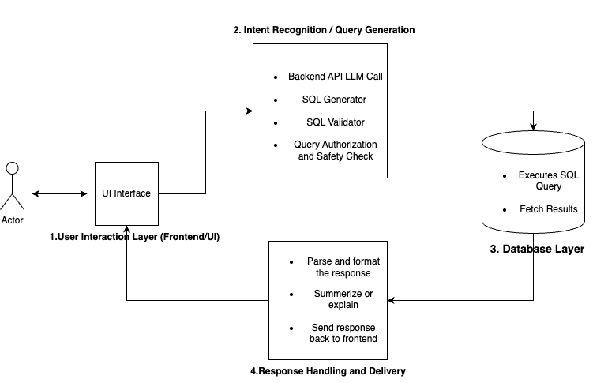

# MySQL Python Chatbot 

## Features
- **Natural Language Processing**: Uses GPT-4 to interpret and respond to user queries in natural language.
- **SQL Query Generation**: Dynamically generates SQL queries based on the user's natural language input.
- **Database Interaction**: Connects to a SQL database to retrieve query results, demonstrating practical database interaction.
- **Streamlit GUI**: Features a user-friendly interface built with Streamlit, making it easy for users of all skill levels.
- **Python-based**: Entirely coded in Python, showcasing best practices in software development with modern technologies.

## Brief Explanation of How the Chatbot Works

The chatbot works by taking a user's natural language query, converting it into a SQL query using GPT-4, executing the query on a SQL database, and then presenting the results back to the user in natural language. This process involves several steps of data processing and interaction with the OpenAI API and a SQL database, all seamlessly integrated into a Streamlit application.

Consider the following diagram to understand how the different chains and components are built:



## Installation
Ensure you have Python installed on your machine. Then clone this repository:

```bash
git clone [repository-link]
cd [repository-directory]
```

Install the required packages:

```bash
pip install -r requirements.txt
```

Create your own .env file with the necessary variables, including your OpenAI API key:

```bash
OPENAI_API_KEY=[your-openai-api-key]
```

## Usage
To launch the Streamlit app and interact with the chatbot:

```bash
streamlit run app.py
```
